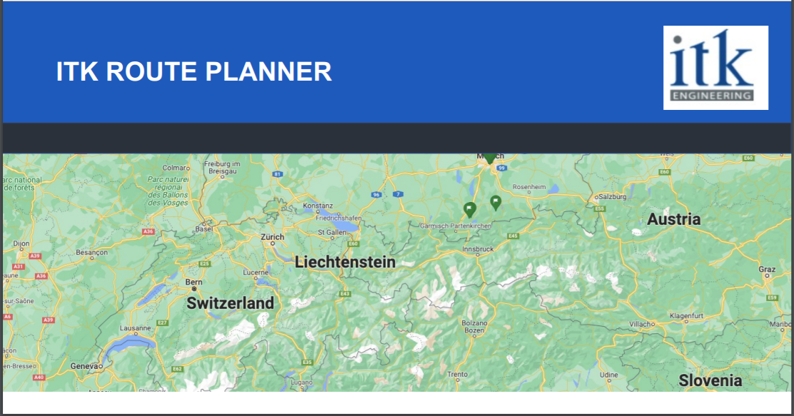
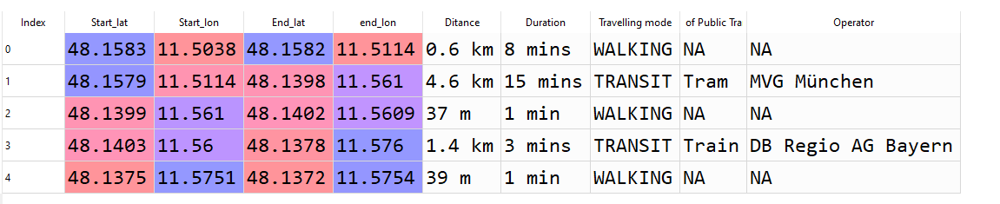

# route-planner

## Functions
### api_processing
Use this function to get list of routes for particular journey. Function has three parameters: 
1. Origin
2. Destination
3. Mode ('driving','transit','bicycling')
### Example
result= get_routes("Nymphenburg Palace","Marienplatz","transit")
*result* will be list of dataframes (routes) broken into coordinates with distance and time. 
One of the dataframe is shown below:

### co2_mapping
Use this function to integrate co2 data with all routes obtained from *api_processing 
co2_mapping(list_of_routes,mode="driving",driving_fuel="Diesel")
This will output as list of all routes with detail of Co2, total duration and total time.
### tojson()
This function will convert result from *co2_mapping into json format as required by frontend.
### find_Routes()
This function will cob´mbine all function above to get final detailed list of routes for all transport mode
